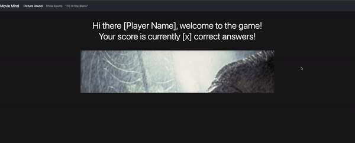
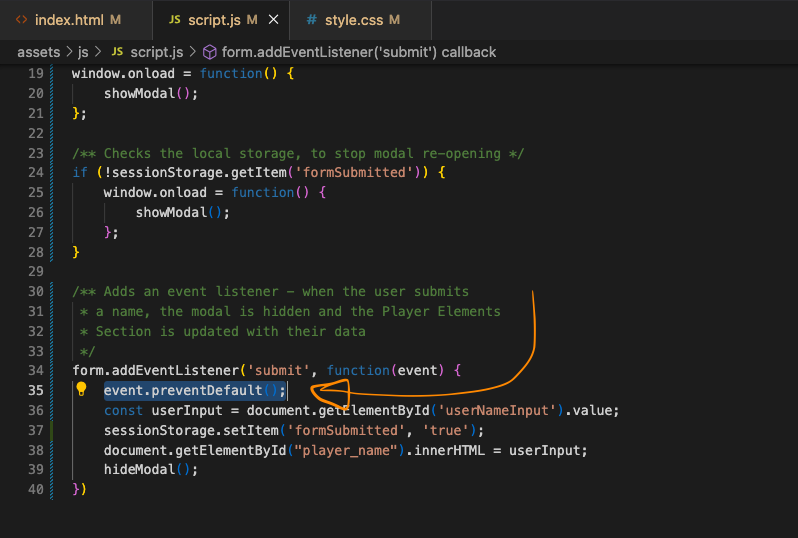
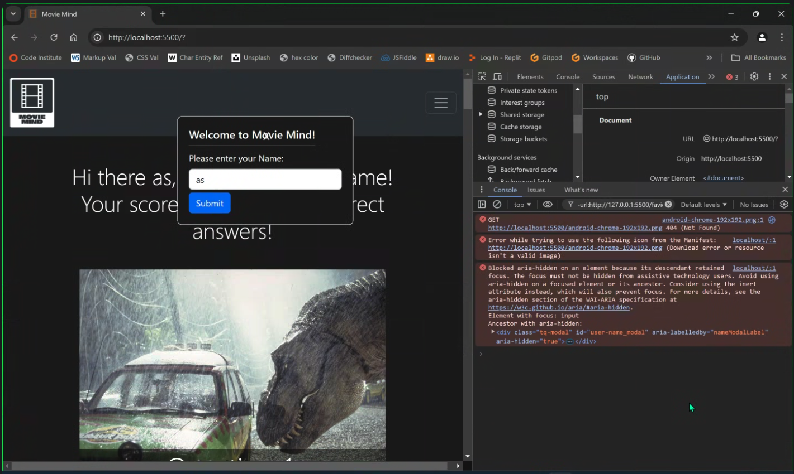
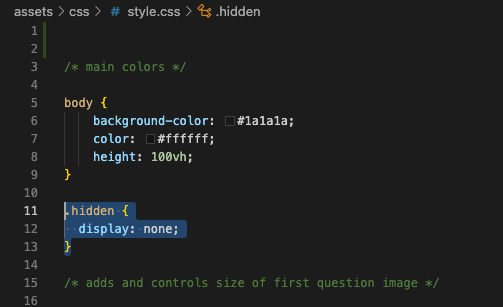

# Welcome to Team-Quiz

## Introduction

[*placeholder for am I responsive screenshot*]

Website link: https://moakley-45.github.io/Team-Quiz/

## Project Overview

The goal of this project is to provide users with a fun, rewarding quiz which challenges their knowledge of popular movies.
With this intention in mind, the website has been designed with three different types of question; A "Picture" question type, a "Trivia" style question, and a "Fill in the blank" question:

[*placeholder for image of each question type, side by side*]

This variety in question presentation and in the popularity of the movies included aims to keep the user entertained and stimulated.

Clean and simple styling combined with large text and images are used to draw the users attention to the main content and minimise distraction.

A combination of styling in CSS and functionality using JavaScript and Bootstrap make the website attractive and engaging, furthering our goals of providing a positive and interactive user experience.

## User stories

### Must Have

As a user I would like to be able to navigate the page in order to access all of the quiz categories. 

As a user I would like to be able to see what the correct answer is to each question in order to know if I answered correctly or not. 

As a user I would like visual cues for each question in order to feel engaged in the quiz.

As a user I would like to be able to see my score in order to gauge how good I am at movie trivia.

As a user I would like to be presented with multiple choices in order to make it easier to answer questions.

As a site admin, I want a strong logo to create a strong sense of brand identity and visually represent the site.

As a site admin, I need a favicon to complete the site's design and add visual cohesion with the site's logo

### Should Have

As a user I would like to be able to select my difficulty level in order to make the quiz challenging but achievable.

As a product owner I would like to be able to encourage an active user base in order to future benefit from monetized adverts.

As a user I would like a time limit in order to add a sense of urgency to my play time.

As a returning user I would like modulated feedback in order to be encouraged to try again.

### Could Have

As a product owner I would like my users to be able to create an account in order to contact users with updates and increase screen time. 

As a user I would like my score to appear on a leaderboard in order to compare my score with other users.

As a product owner I would like exclusive quizzes for VIP users in order to create a sense of exclusivity.

### Won’t Have

As a product owner I would like to add premium accounts in order to further monetize the website.

As a product owner I would like to be able to see what my users think of the quiz in order to tailor future development.

As a user I would like to have visual celebration when I answer all the questions correctly in order to feel great in my success.

## List of Features

Based on our user stories and their rated importance, we developed the following existing features, and planned future features for a later iteration.

### Existing features
- Navbar
- Score
- Right/wrong
- Images
- Multiple choice

### Future features

- High priority
    - Leaderboard
    - Difficulty level
    - Adverts
    - Account
    - Timer
- Lower priority
    - Premium accounts
    - User reviews

## UX/UI

[*placeholder for Wireframes*]

## Testing

Example Bug:

We had an issue with the modal used to accept and display the user's submitted name; the modal would reset as the page re-loaded after the submission, creating an endless loop:

This was finally resolved in mob programming, with the insertion of this line in the function as per Eva's suggestion:

This fully resolved the issue.

Example Bug 2:

We had a second issue with the above Modal implementation - the user could insert their name and the expected HTML changes would take place ; yet the Modal would not close:

This was triaged as being due to missing CSS styling that was needed as part of the javascript, that had been lost between merges. Returning this CSS resolved the issue, and allowed the 'Hide Modal' function to work correctly again:

## Deployment

Deployed on GitHub Pages on 22-10-2024 using Main Branch
Deployed Project can be found at this link: https://moakley-45.github.io/Team-Quiz/

## Citation of Sources

## Future Features

## Known Bugs
