# Welcome to Team-Quiz

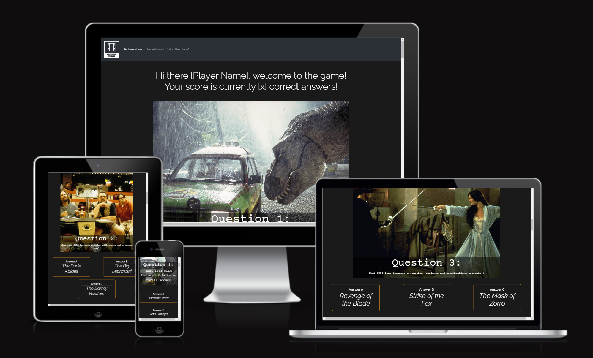

Website link: https://moakley-45.github.io/Team-Quiz/

## Project Overview

The goal of this project is to provide users with a fun, rewarding quiz which challenges their knowledge of popular movies.
With this intention in mind, the website has been designed with three different types of question; A "Picture" question type, a "Trivia" style question, and a "Fill in the blank" question. The wireframes for these are in the UX / UI section below.

This variety in question presentation and in the popularity of the movies included aims to keep the user entertained and stimulated.

Clean and simple styling combined with large text and images are used to draw the users attention to the main content and minimise distraction.

A combination of styling in CSS and functionality using JavaScript and Bootstrap make the website attractive and engaging, furthering our goals of providing a positive and interactive user experience.

## User stories

### Must Have

As a user I would like to be able to navigate the page in order to access all of the quiz categories. 

As a user I would like to be able to see what the correct answer is to each question in order to know if I answered correctly or not. 

As a user I would like visual cues for each question in order to feel engaged in the quiz.

As a user I would like to be able to see my score in order to gauge how good I am at movie trivia.

As a user I would like to be presented with multiple choices in order to make it easier to answer questions.

As a site admin, I want a strong logo to create a strong sense of brand identity and visually represent the site.

As a site admin, I need a favicon to complete the site's design and add visual cohesion with the site's logo

### Should Have

As a user I would like to be able to select my difficulty level in order to make the quiz challenging but achievable.

As a product owner I would like to be able to encourage an active user base in order to future benefit from monetized adverts.

As a user I would like a time limit in order to add a sense of urgency to my play time.

As a returning user I would like modulated feedback in order to be encouraged to try again.

### Could Have

As a product owner I would like my users to be able to create an account in order to contact users with updates and increase screen time. 

As a user I would like my score to appear on a leaderboard in order to compare my score with other users.

As a product owner I would like exclusive quizzes for VIP users in order to create a sense of exclusivity.

### Won’t Have

As a product owner I would like to add premium accounts in order to further monetize the website.

As a product owner I would like to be able to see what my users think of the quiz in order to tailor future development.

As a user I would like to have visual celebration when I answer all the questions correctly in order to feel great in my success.

## List of Features (Existing)

Based on our user stories and their rated importance, we developed the following existing features, and planned future features for a later iteration.

- Navbar
- Score
- Right/wrong
- Images
- Multiple choice

Features that are yet to be implemented are detailed below in the "Future Features" section.

## UX/UI

Below are the Wireframes for mobile phone view, tablet view and desktop view for each of the three Question Types we designed, however, only "Picture Round" questions were completed in the time allocated. The rest have been postponed until the next iteration.

Mobile view:

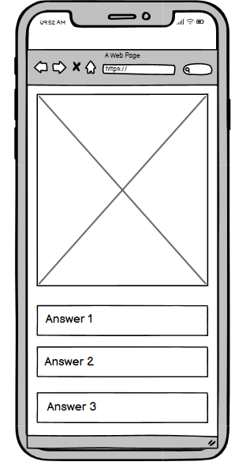 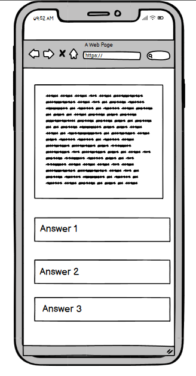 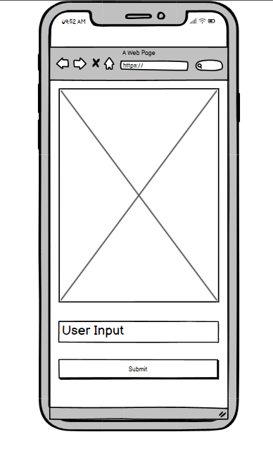

Tablet view:

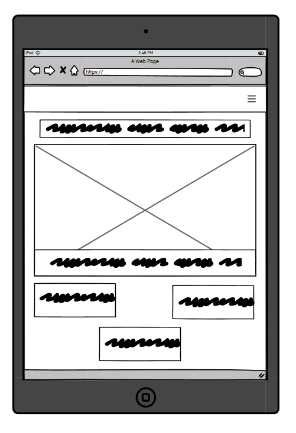 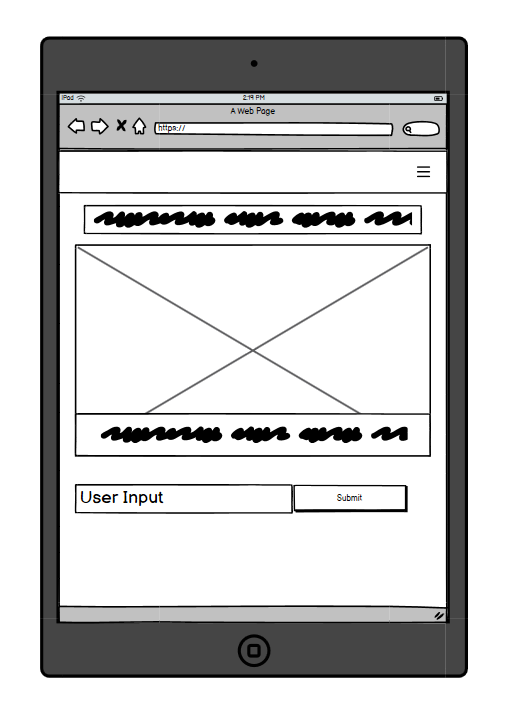 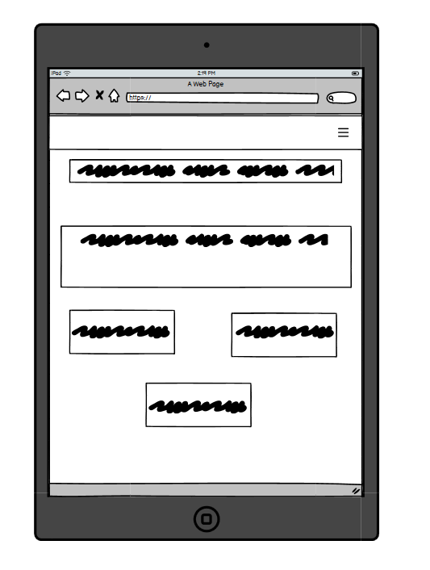

Desktop view:

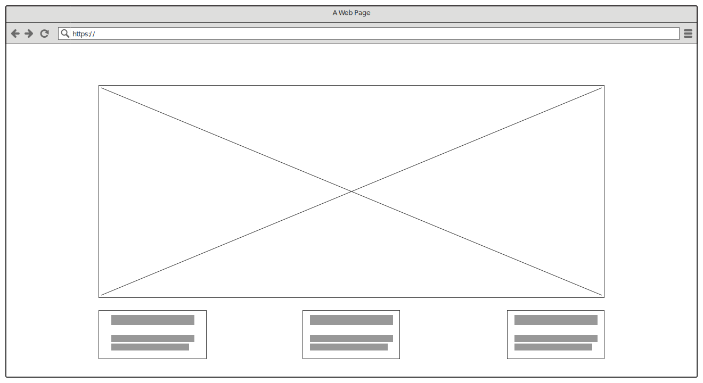 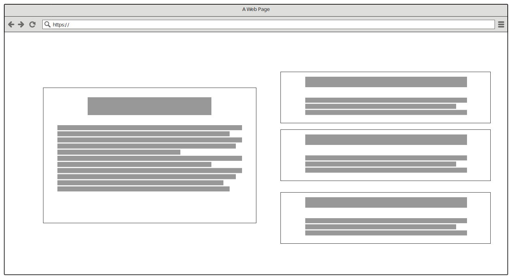 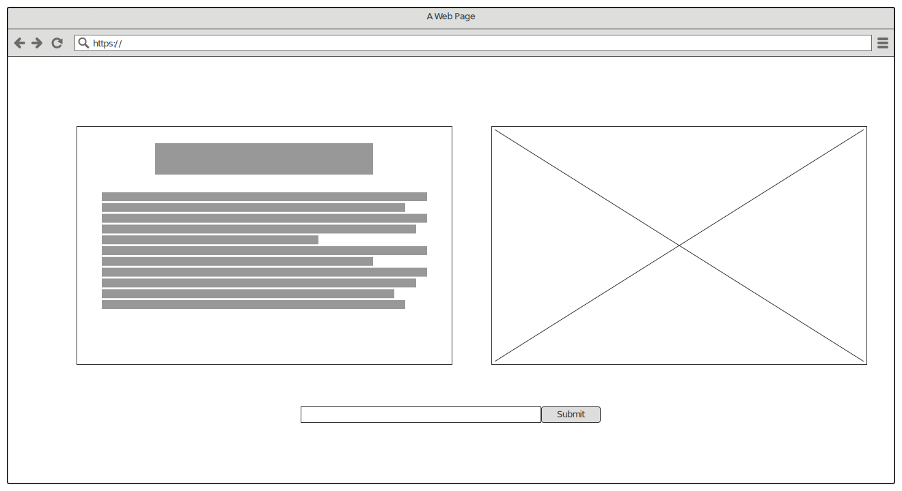

## Testing

### Validators

We put our code through online validators and they all returned with no errors:

- HTML - we put it through Jigsaw Validator 

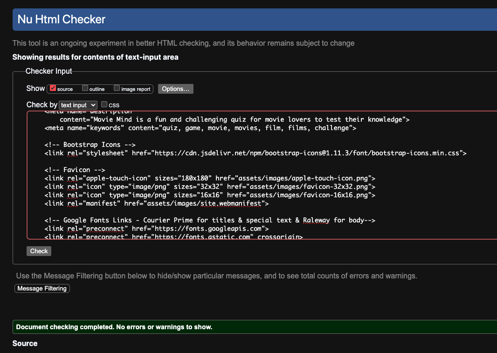

- CSS - we put it through Jigsaw Validator 

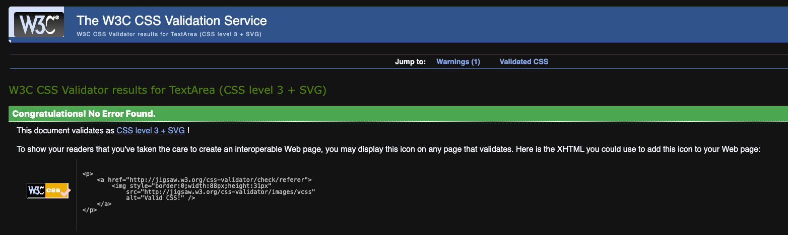

- JS - we put it through ManagEngine

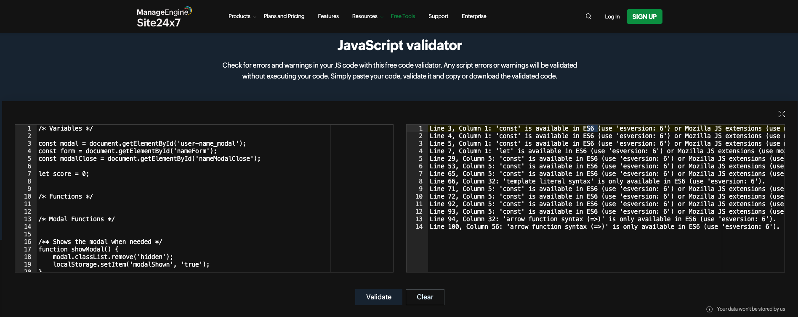

### Bugs
Example Bug:

We had an issue with the modal used to accept and display the user's submitted name; the modal would reset as the page re-loaded after the submission, creating an endless loop:

This was finally resolved in mob programming, with the insertion of this line in the function as per Eva's suggestion:

This fully resolved the issue.

Example Bug 2:

We had a second issue with the above Modal implementation - the user could insert their name and the expected HTML changes would take place ; yet the Modal would not close:

This was triaged as being due to missing CSS styling that was needed as part of the javascript, that had been lost between merges. Returning this CSS resolved the issue, and allowed the 'Hide Modal' function to work correctly again:

Example Bug 3:

We had an issue with the Modal feature failing to close if the user tries to use the optional Close button:

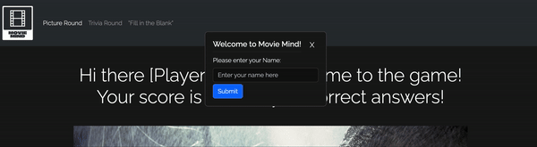

This has been fixed by adding a new Event Listener, to resolve this issue:

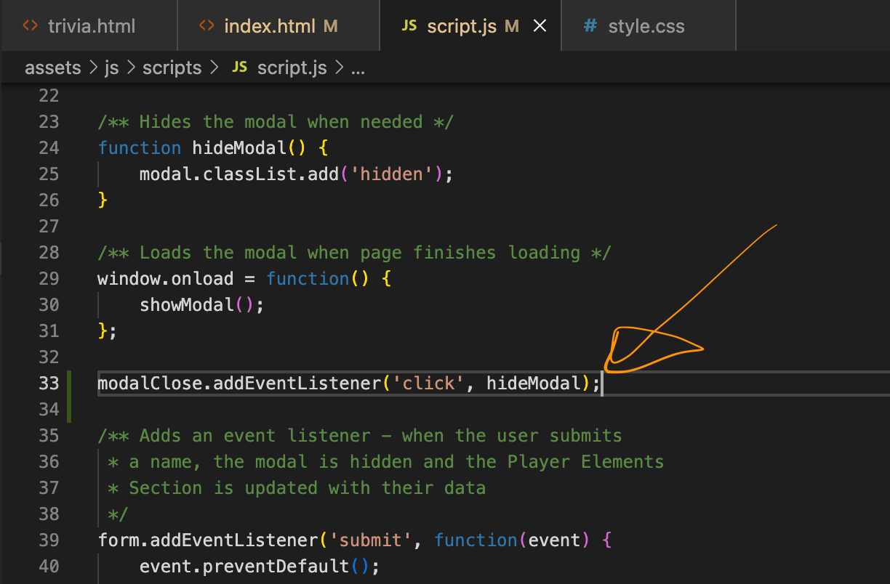

## Deployment

Deployed on GitHub Pages on 22-10-2024 using Main Branch.

The site was deployed to GitHub pages. The steps to deploy are as follows:
- In the GitHub repository, navigate to the Settings tab
- From the source section drop-down menu, select the Main Branch
- Once the main branch has been selected, the page will be automatically refreshed with a detailed ribbon display to indicate the successful deployment.
- The live link can be found here - (https://moakley-45.github.io/Team-Quiz/)

## Citation of Sources

### Content
- The text for the Deployment section of this README.md was taken from the CI README.md template (https://github.com/Code-Institute-Solutions/readme-template)
- The fonts were obtained from Google Fonts (https://fonts.google.com/)

### Media
- The images were taken from imdB (https://imdb.com/)
- The Favicon was created using Favicon.io (https://favicon.io/)
- The logo was created using LOGO.com (https://logo.com/)
- The icons were taken from Flat Icon and are all under copyright of their original uploaders

## Future Features

- Trivia page
- Fill The Blanks page
- Difficulty rating for quiz content
- Adverts displayed on the page
- Timer for quiz time limit
- Feedback message box after quiz completion
- Ability to create an account and log in
- Leaderboard for members
- Premium membership
- Exclusive quizzes for premium members
- User reviews/star rating for each quiz
- Celebration graphic for 100% correct answers

## Known Bugs

#### Trivia Page Functionality

We had difficulties getting one of our Javascript functions to apply to the trivia page. 
The function worked fine on our main page but, due to time constraints, we could not find the error which causes it to not respond as intended on the trivia page.

To be rectified at start of next sprint.

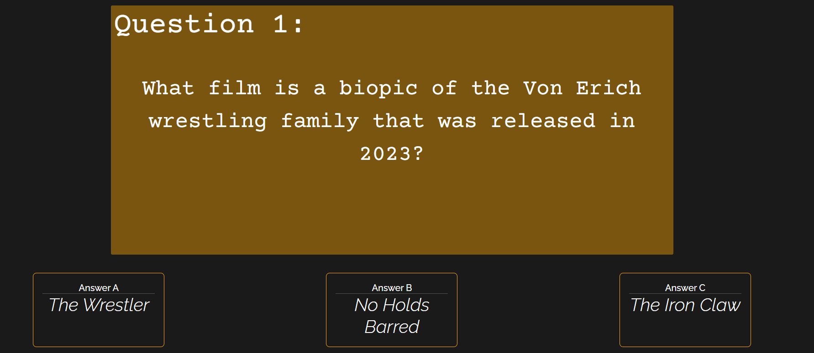

